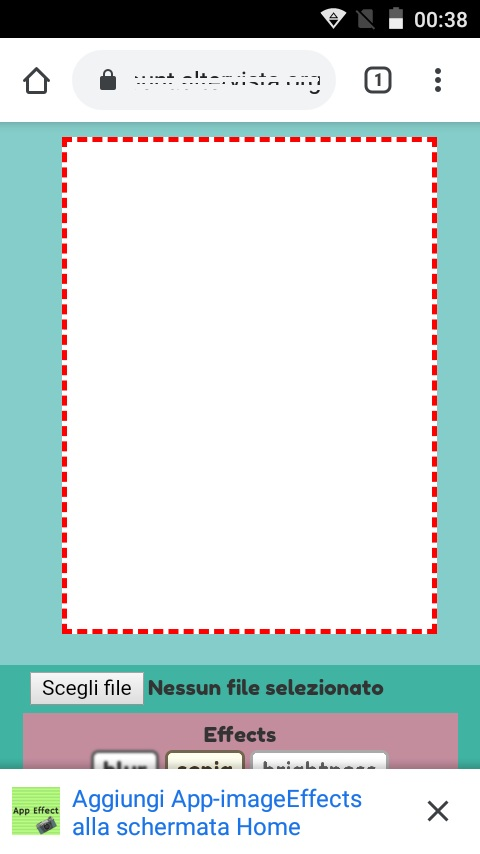
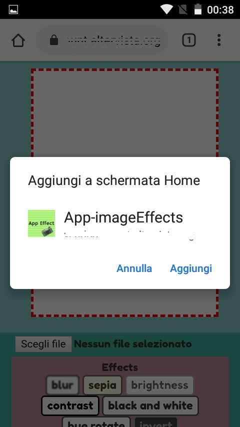

# PWA_imageEffects
Progressive web application to customize photos and insert filters

<h2> Introduction </h2>
This is a simple progressive web application that allows you to apply graphic filters to your photos and you can download the modified photo.

<h2> Description</h2>

To create this PWA I used the "canvas" tag to allow you to edit the image and downloading it.
For more informations follow https://developer.mozilla.org/en-US/docs/Web/API/CanvasRenderingContext2D/filter

<h2>&#x1F53A; Warning &#x1F53A; </h2>
The web application only works in Chrome and Firefox browsers.

<h2> Images </h2>

Screenshot 1 main page

Screenshot PWA responsive design

Screenshot Add Home screen
