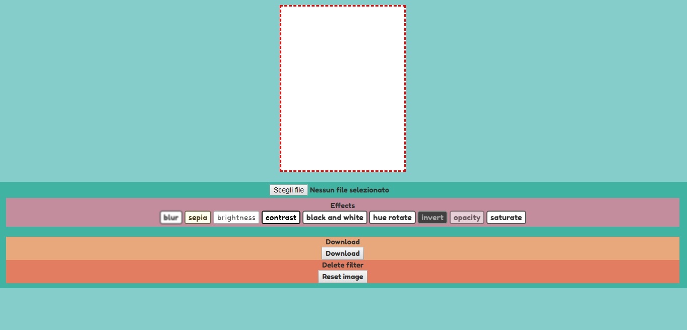
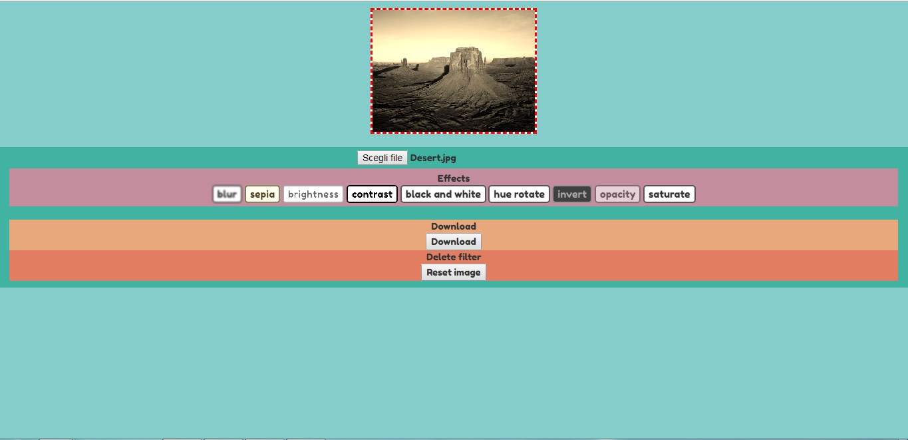
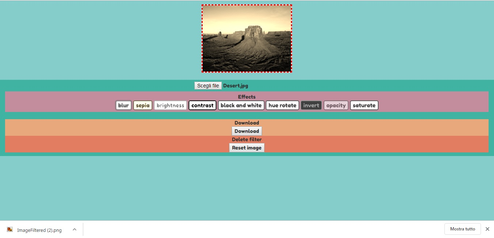

# App_imageEffects
Web app to customize photos and insert filters

<h2> Introduce </h2>
This is a simple web application that allows you to apply graphic filters to photographs, subsequently you can download the modified image.

<h2> Description</h2>

To create this web application I used the "canvas" tag to allow you to edit the image and downloading it.
For more informations follow https://developer.mozilla.org/en-US/docs/Web/API/CanvasRenderingContext2D/filter

<h2>&#x1F53A; Warning &#x1F53A; </h2>
Alert! The web application only works in Chrome and Firefox browsers!
I didn't use Modernizr to optimize the browser compatibility.

<h2> Screenshot </h2>

Screenshot 1 main page

Screenshot 2 upload photo

Screenshot 3 download

Screenshot responsive design
